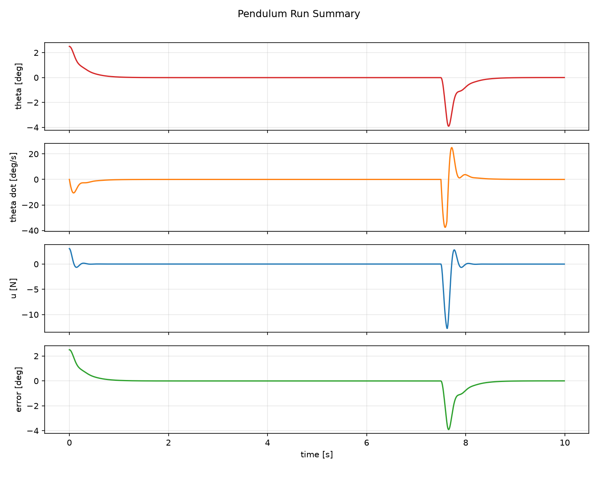
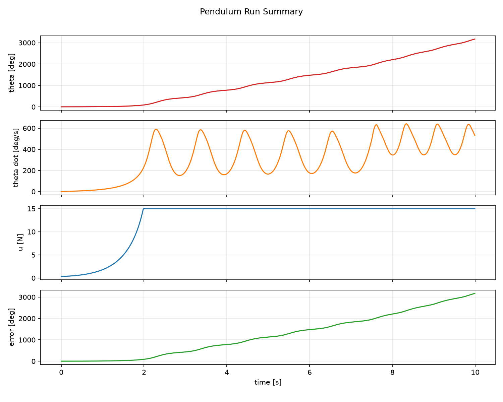

# PID Controller Simulation — Self-Balancing Inverted Pendulum

This project simulates a classic robotics control problem: balancing an inverted pendulum on a moving cart with a **manual PID controller** (no control-toolbox shortcuts).

It demonstrates how feedback control stabilizes an unstable nonlinear system in real time, including:

- physics from first principles,
- PID with anti-windup and derivative filtering,
- live rendering + live state plots,
- online gain tuning with sliders,
- disturbance rejection metrics and run logging.

## Why this matters

The inverted pendulum is a standard benchmark for robotic balancing systems (e.g., mobile robots, reaction-wheel systems, biped posture control). This project shows the full loop from dynamics to controller behavior and measurable recovery performance.

## Project layout

```text
pid_pendulum/
  main.py
  physics.py
  pid.py
  visualizer.py
  plotter.py
  logger.py
  config.json
  requirements.txt
  README.md
  examples/
  logs/
```

## Install + run

From this folder:

```bash
python -m venv .venv
source .venv/bin/activate
pip install -r requirements.txt
python main.py --config config.json
```

Headless run (useful on servers):

```bash
python main.py --config config.json --headless --no-realtime
```

## Tuning PID gains during runtime

When GUI mode is enabled:

- a `pygame` window shows cart + pole motion;
- a `matplotlib` window shows live state traces;
- sliders at the bottom let you tune `Kp`, `Ki`, `Kd` in real time.

### Physical meaning of each term

- **Kp (proportional):** reacts to current angle error.  
  Too low = sluggish correction, too high = aggressive oscillation.
- **Ki (integral):** removes residual bias (e.g., slight constant disturbances).  
  Too high = windup and slow oscillatory recovery.
- **Kd (derivative):** damps motion by reacting to angular rate trend.  
  Too low = overshoot, too high = noisy/jerky control.

The controller in `pid.py` includes:

- output limits,
- integral clamping + back-calculation anti-windup,
- first-order derivative filtering.

## Disturbance + step response metrics

A force impulse is injected mid-run (`disturbance` section in `config.json`).

Each run logs:

- full state (`x`, `x_dot`, `theta`, `theta_dot`),
- PID internals (`error`, `P`, `I`, `D`, `output`),
- disturbance force,
- computed response metrics:
  - recovery time,
  - overshoot percentage,
  - steady-state error.

Outputs are written to:

- `logs/run_<timestamp>.csv`
- `logs/run_<timestamp>_metrics.json`

Example metrics from a stable logged run (`run_20260616_082721_metrics.json`):

- recovery time: `0.14 s`
- overshoot: `16.64 %`
- steady-state error: `0.0028 deg`

## Sample behavior snapshots

Stable tuning example:



Unstable tuning example:



You can regenerate figures with:

```bash
# Stable-ish gains (from config defaults)
python main.py --headless --no-realtime --duration 10 --save-plot examples/stable_run.png

# Deliberately bad tuning
python main.py --config config_unstable.json --headless --no-realtime --duration 10 --save-plot examples/unstable_run.png
```
