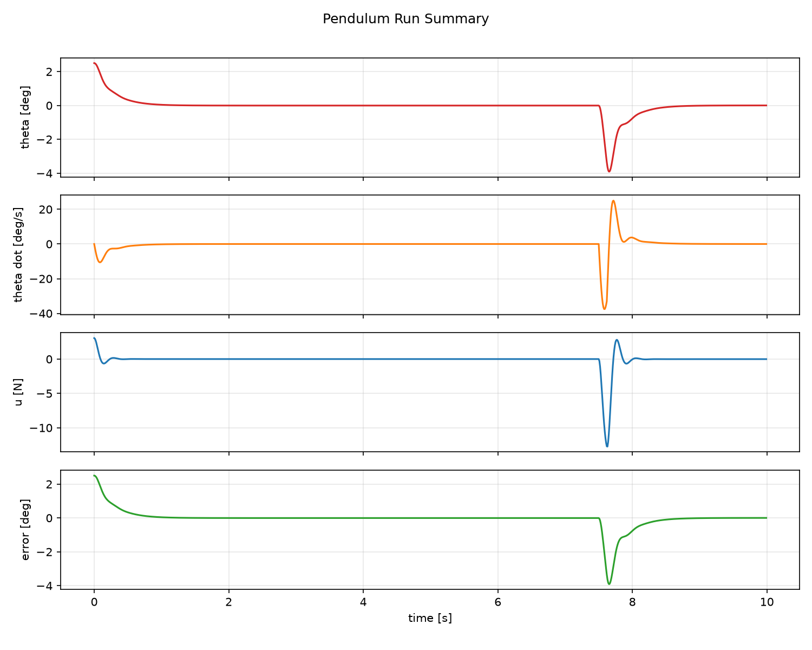
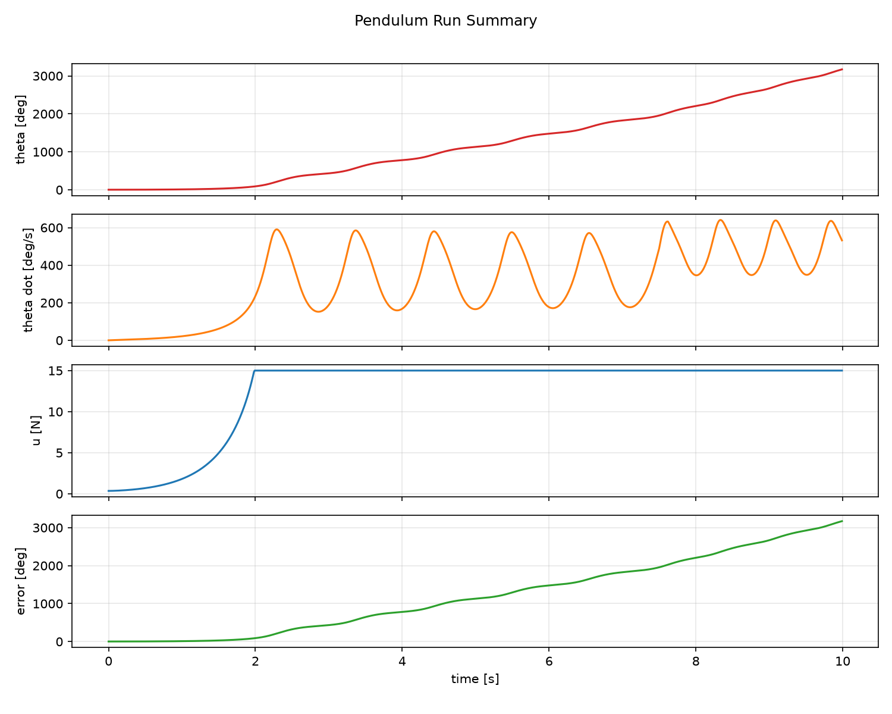

# PID Inverted Pendulum Simulation

## About

This is a Python project I built to learn how a PID controller works by balancing a stick (pendulum) on a moving cart. The stick starts at a random angle, and the controller tries to keep it upright by moving the cart left and right.

I wanted something I could actually see and play with — not just math on a page — so I added a live animation, real-time graphs, and sliders so I can change the PID gains while the simulation is running.

---

## Features

- Physics for the cart and pendulum (position, speed, angle)
- A PID controller I wrote myself in Python (no control libraries)
- Live animation with **Pygame**
- Live graphs with **Matplotlib** (angle, speed, force, error)
- Sliders to tune Kp, Ki, and Kd during the run
- Ability to give the cart a push mid-run and see if it recovers
- Saves each run to CSV/JSON so I can look at the results later

---

## Preview

### Stable run

When the gains are tuned well, the pendulum stays up and recovers after a push:



### Unstable run

When the gains are off, it falls over:



---

## Tools I Used

Based on what I already use in school and other projects:

- **Python** — main language for the whole project
- **NumPy** — math and physics calculations
- **Matplotlib** — live graphs and gain sliders
- **Pygame** — cart-and-pendulum animation
- **Git** — version control
- **CSV / JSON** — saving run data and settings

Settings (physics values and PID gains) live in JSON files, so I can try different setups without changing the code.

---

## Project Layout

```text
pid_pendulum/
├── main.py               # starts the simulation
├── physics.py            # cart + pendulum physics
├── pid.py                # PID controller
├── visualizer.py         # Pygame animation
├── plotter.py            # Matplotlib graphs + sliders
├── logger.py             # saves run data
├── config.json           # normal (stable) settings
├── config_unstable.json  # bad gains on purpose
├── requirements.txt
├── examples/
└── logs/
```

---

## How It Runs

Each step of the simulation does this:

1. Read where the cart and pendulum are
2. Have the PID decide how hard to push the cart
3. Optionally add a small push (disturbance)
4. Update the physics
5. Update the animation and graphs
6. Log the data

---

## How To Run

```bash
pip install -r requirements.txt
python main.py
```

Use `config_unstable.json` if you want to see it fail on purpose.

---

## What I Learned

- How P, I, and D each affect balance and recovery
- Why bad gains make the system overshoot or fall
- How to connect a controller to a live animation and graphs
- How to test a controller by disturbing it and measuring recovery

This project helped me connect class math (like ODEs and linear algebra) to something visual I could tune by hand.
